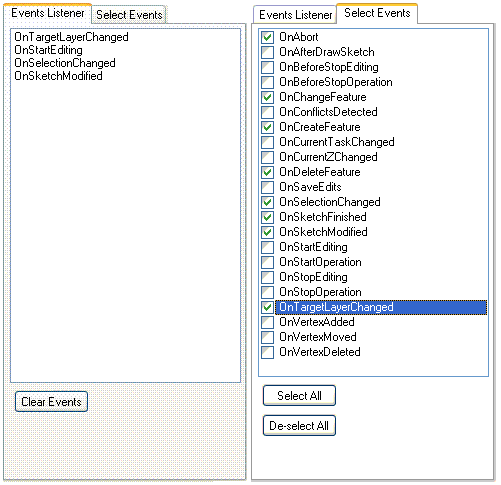

##Edit event listener

###Purpose  
This sample provides the ability to understand when various edit events are fired in response to changes in the editing environment or user actions.  Using this sample can help you ascertain which events are appropriate to listen for in various situations, and understand what causes a given event to fire.  

###Usage
####Running the solution  
1. Ensure you have all data files in the following folder location: <your install developer kit location>/Samples/data/StreamflowDateTime.  
1. Build and run the solution.  
1. Click the Select Events tab to choose the events to monitor.  
1. Click the Events Listener tab to view the fired events.  
1. Start editing and perform edit operations to trigger events, then view events.  
1. Right-click in the Events Listener tab to clear the list of events. See the following screen shot:  

  
Screen shot showing the Events Listener and Select Events tabs.  

####See Also  
[How to listen to edit events](http://desktop.arcgis.com/search/?q=How%20to%20listen%20to%20edit%20events&p=0&language=en&product=arcobjects-sdk-dotnet&version=&n=15&collection=help)  

---------------------------------

####Licensing  
| Development licensing | Deployment licensing | 
| :------------- | :------------- | 
| Engine Developer Kit | Engine |  
|  | ArcGIS for Desktop Basic |  
|  | ArcGIS for Desktop Standard |  
|  | ArcGIS for Desktop Advanced |  

