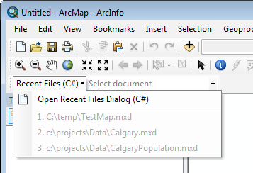

##Recently used files—Command, MultiItem, and ComboBox

###Purpose  
This sample shows how to implement different styles of custom commands—a normal button command, a MultiItem command, and a combo box—to customize ArcGIS for Desktop applications. All three types of commands perform the same functionality: listing and opening recently used documents. This sample also shows how to create a custom toolbar and menu with your custom command.   

###Usage
1. Open and compile the sample project in Visual Studio. Set up a debug application if needed.  
1. This sample works in ArcMap, ArcScene, or ArcGlobe. Open any of the applications.  
1. Turn on the Recent Files (C#) or Recent Files (VB) toolbar from the Customize dialog box or toolbar list, depending on the language project you have compiled.  
1. Expand the Recent Files menu to interact with the command and MultiItem command to open any of the recently used documents. You can also open a document in the Recent Files list with the drop-down list tool control. See the following screen shot:  

  
Screen shot of the Recent Files list  

####See Also  
[How to create dynamic menu commands using a MultiItem](http://desktop.arcgis.com/search/?q=How%20to%20create%20dynamic%20menu%20commands%20using%20a%20MultiItem&p=0&language=en&product=arcobjects-sdk-dotnet&version=&n=15&collection=help)  

---------------------------------

####Licensing  
| Development licensing | Deployment licensing | 
| :------------- | :------------- | 
| ArcGIS for Desktop Basic | ArcGIS for Desktop Basic |  
| ArcGIS for Desktop Standard | ArcGIS for Desktop Standard |  
| ArcGIS for Desktop Advanced | ArcGIS for Desktop Advanced |  

