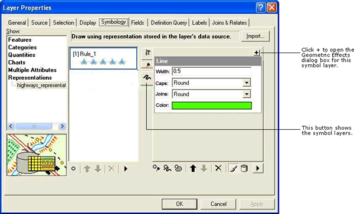

## Create custom move, rotate, and scale GeometricEffects within a single project

  <div xmlns="http://www.w3.org/1999/xhtml">This sample tool demonstrates how to create multiple sets of geometric effects in a single project and adds it to the existing list of geometric effects. Three geometric effects for move, rotate, and scale are included in the sample.</div>
  <div xmlns="http://www.w3.org/1999/xhtml"> </div>
  <div xmlns="http://www.w3.org/1999/xhtml">IGeometricEffect and IGraphicAttributes are the two basic interfaces that are required to be implemented by every geometric effect class. IPersistVariant interface is implemented, in addition to persist the class.</div>
  <div xmlns="http://www.w3.org/1999/xhtml"> </div>
  <div xmlns="http://www.w3.org/1999/xhtml">The sample also implements IEditInteraction so that all graphic attributes that are used to control the custom class will be exposed using the graphical user interface (GUI) through the representation tools. </div>  


<!-- TODO: Fill this section below with metadata about this sample-->
```
Language:              C#, VB
Subject:               Map
Organization:          Esri, http://www.esri.com
Date:                  11/17/2017
ArcObjects SDK:        10.6
Visual Studio:         2015, 2017
.NET Target Framework: 4.5
```

### Resources

* [ArcObjects .NET API Reference online](http://desktop.arcgis.com/en/arcobjects/latest/net/webframe.htm)  
* [Sample Data Download](../../releases)  
* [What's new](http://desktop.arcgis.com/en/arcobjects/latest/net/webframe.htm#05247c04-bfd9-4e36-ae09-bc6e833c3b14.htm)  
* [Download the ArcObjects SDK for .Net from MyEsri.com](https://my.esri.com/)  

### Usage
1. Open the Visual Studio solution file and build the project. This adds the custom object into the ESRI Representation Geometric Effect component category as GETransformCSharp.GETransform_Move, GETransformCSharp.GETransform_Rotate, and GETransformCSharp.GETransform_Scale. The component name will differ if the VB.NET project solution is built.  
1. Open a new or existing ArcMap document.  
1. Click the Add Data button to add a point, line, or polygon feature class with representations to the map document.   
1. In the Layer Properties dialog box, change the Feature Renderer to Representation Renderer on the Symbology tab.  
1. Select any Representation Rule (for example, RuleA) in the Representation Renderer for which you want to add this custom geometric effect to.  
1. Select a symbol layer (for example, LayerA) in this representation rule or add a new symbol layer.  
1. Click + next to the selected symbol layer to open the Geometric Effects dialog box, which lists all geometric effects. The custom classes will be listed under the point, line, and polygon input options. Select one of the effects from Transform Move, Transform Rotate, or Transform Scale to produce either a move, rotate, or scaling effect on the display geometries.   
1. Change the values for the graphic attributes for these custom effects or accept the default values.  
1. Close the Layer Properties dialog box.  
1. Start an edit session to interactively modify these attributes.   
1. Select a feature representation that uses the rule applied with the Move custom effect using the Select tool in the Representation toolbar.   
1. Click the Representation Properties tool in the toolbar to open a dialog box. Make sure that the Tool tab is also selected.  
1. Select the Move tool in the Representation toolbar. All attributes that can be modified interactively using the Resize tool appear in a list under the layer (LayerA). You will see both attributes of the Move effect (X and Y offset distances) listed.  
1. Check the check boxes for the attributes and use the Move tool to interactively modify the attributes.   
1. Clear the check boxes if you do not want to modify these attributes interactively.  
1. Similarly, rotate and resize the representation tools present in the Representation toolbar can be used interactively in an edit session to work with the rotate and resize custom geometric effects.  


  
The Layer Properties dialog box with highlighted tabs and buttons used in this sample.   


#### Additional information  
<div xmlns="http://www.w3.org/1999/xhtml">
  <strong>Description of the tools</strong>
</div>  
<div xmlns="http://www.w3.org/1999/xhtml">
  <br />Move Geometric Effect—This sample tool allows a point, line, and polygon geometry to be processed to result in a Move effect, moving display geometry by a given x and y offset distances. The Move representation tool in the Representations toolbar can be interactively used to modify the x and y offset distances in an edit session.<br /><br />Rotate Geometric Effect—This sample tool allows a line and polygon geometry to be processed to result in a Rotate effect, rotating display geometry by a given rotation angle. The Rotate representation tool in the Representations toolbar can be interactively used to modify the angle of rotation in an edit session.<br /><br />Scale Geometric Effect—This sample tool allows a line and polygon geometry to be processed to result in a Scale effect, scaling the display geometry by a given x and y scaling factors. The Resize representation tool in the Representations toolbar can be interactively used to modify the x and y scaling factors in an edit session.</div>  


---------------------------------

#### Licensing  
| Development licensing | Deployment licensing | 
| ------------- | ------------- | 
| ArcGIS Desktop Basic | ArcGIS Desktop Basic |  
| ArcGIS Desktop Standard | ArcGIS Desktop Standard |  
| ArcGIS Desktop Advanced | ArcGIS Desktop Advanced |  


